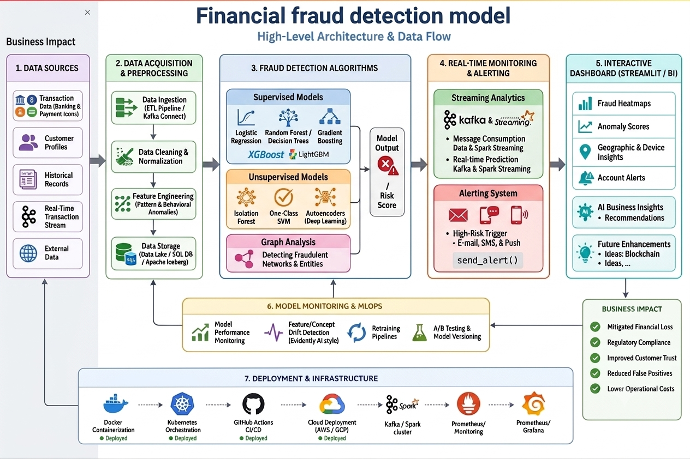

# Financial Fraud Detection Model
 The Financial Fraud Detection Model utilizes Machine Learning (ML) and Data  Analytics to identify suspicious transactions, detect fraudulent activities, and provide real time insights via an interactive dashboard. This system is essential for banks, fintech  companies, and financial institutions to mitigate risks and prevent financial fraud. 
 <div align="center">
  
--
##  Live Deployment

### 🔗 Streamlit App

https://financial-fraud-detection-model-vpeitz9ssc4mjfqsor2vig.streamlit.app/

### 🔗 GitHub Repository

https://github.com/tirthabrata0407-cloud/Financial-Fraud-Detection-Model#

##  Objectives

* Detect fraudulent financial transactions using Machine Learning.
* Analyze transaction patterns and fraud trends.
* Identify high-risk transaction behaviors.
* Provide real-time fraud prediction capabilities.
* Support financial institutions in fraud prevention and risk management.

---

##  Tech Stack

| Component | Tools & Libraries |
| :--- | :--- |
| **Programming Language** | Python |
| **Data Analysis & Processing** | Pandas, NumPy |
| **Machine Learning** | Scikit-learn (Random Forest Classifier) |
| **Data Visualization** | Plotly, Matplotlib |
| **Web Application** | Streamlit |
| **Model Storage** | Joblib |
| **Database** | SQLite |

---
---

## Project Structure
```
Financial-Fraud-Detection-model/
│
├── models/
│
├── app.py
├── train_model.py
├── data_preprocessing.py
├── fraud_data.db
├── requirements.txt
├── .gitignore
└── README.md
```

---

##  Features

### Fraud Detection
* Predict fraudulent transactions using Machine Learning.
* Risk scoring and fraud classification.

### Transaction Analysis
* Transaction amount analysis.
* Account balance behavior tracking.
* High-risk transaction identification.

### Data Processing
* Data cleaning and preprocessing.
* Feature engineering.
* Handling missing values and outliers.

### Model Evaluation
* Accuracy Score
* Precision
* Recall
* F1-Score
---

##  Machine Learning Workflow

### 1. Data Preprocessing
* Data cleaning
* Duplicate removal
* Missing value handling
* Feature transformation
  
### 2. Feature Engineering
* Transaction behavior analysis
* Balance change calculations
* Risk indicator generation
  
### 3. Model Training
* Train-Test Split
* Random Forest Classifier
* Model evaluation
  
### 4. Fraud Prediction
* Transaction classification
* Fraud probability estimation
* Risk assessment
---
##  Key Insights

The system helps identify:
* Suspicious transaction patterns
* High-risk account activities
* Unusual balance changes
* Potential fraudulent transactions
* Fraud-prone transaction categories
---
##  Installation

### Clone Repository
```bash

git clone https://github.com/laharisetty29/Financial-Fraud-Detection.git
cd Financial-Fraud-Detection-model
```

### Install Dependencies

```bash
pip install -r requirements.txt
```

### Train the Model

```bash
python train_model.py
```

### Run the Streamlit Application

```bash
python -m streamlit run app.py
```

---

## Future Enhancements

* Real-time fraud monitoring
* Advanced anomaly detection
* Deep Learning models
* Fraud alert notification system
* Cloud deployment
* Interactive analytics dashboard

---

##  Learning Outcomes

Through this project, I gained hands-on experience in:

* Data Cleaning & Preprocessing
* Feature Engineering
* Machine Learning Model Development
* Fraud Analytics
* Streamlit Application Development
* Data Visualization
* Model Deployment

---

##  Author

**Tirthabrata Das**

* GitHub: https://github.com/tirthabrata0407-cloud
* LinkedIn: https://www.linkedin.com/in/tirthabratadas2001/
